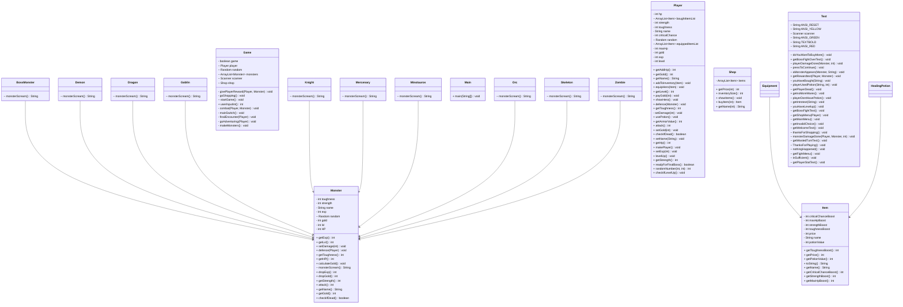

```mermaid
classDiagram
direction TD
class BossMonster {
  ~ monsterScream() String
}
class Demon {
  ~ monsterScream() String
}
class Dragon {
  ~ monsterScream() String
}
class Equipment
class Game {
  - boolean game
  ~ Player player
  ~ Random random
  ~ ArrayList~Monster~ monsters
  ~ Scanner scanner
  ~ Shop shop
  - givePlayerReward(Player, Monster) void
  - goShopping() void
  ~ startGame() void
  + userInputInt() int
  - combat(Player, Monster) void
  - mainSwitch() void
  - finalEncounter(Player) void
  - goAdventuring(Player) void
  - makeMonsters() void
}
class Goblin {
  ~ monsterScream() String
}
class HealingPotion
class Item {
  - int criticalChanceBoost
  - int maxHpBoost
  - int strengthBoost
  - int toughnessBoost
  - int price
  - String name
  - int potionValue
  + getToughnessBoost() int
  + getPrice() int
  + getPotionValue() int
  + toString() String
  + getName() String
  + getCriticalChanceBoost() int
  + getStrengthBoost() int
  + getMaxHpBoost() int
}
class Knight {
  ~ monsterScream() String
}
class Main {
  + main(String[]) void
}
class Mercenary {
  ~ monsterScream() String
}
class Minotauros {
  ~ monsterScream() String
}
class Monster {
  - int toughness
  - int strength
  - String name
  - int exp
  ~ Random random
  - int gold
  - int lvl
  - int HP
  + getExp() int
  + getLvl() int
  + setDamage(int) void
  + defence(Player) void
  + getToughness() int
  + getHP() int
  + calculateGold() void
  ~ monsterScream() String
  + dropExp() int
  + dropGold() int
  + getStrength() int
  + attack() int
  + getName() String
  + getGold() int
  + checkIfDead() boolean
}
class Orc {
  ~ monsterScream() String
}
class Player {
  - int hp
  ~ ArrayList~Item~ boughtItemList
  - int strength
  - int toughness
  - String name
  - int criticalChance
  ~ Random random
  ~ ArrayList~Item~ equippedItemList
  - int maxHp
  - int gold
  - int exp
  - int level
  + getAddHp() int
  + getGold() int
  + getName() String
  + addToInventory(Item) void
  + equipHero(Item) void
  + getLevel() int
  + payGold(int) void
  + showHero() void
  + defence(Monster) void
  + getToughness() int
  - setDamage(int) void
  + usePotion() void
  + getArmorValue() int
  + attack() int
  + setGold(int) void
  + checkIfDead() boolean
  + setName(String) void
  + getHp() int
  + makePlayer() void
  + setExp(int) void
  + levelUp() void
  + getStrength() int
  + readyForFinalBoss() boolean
  + randomNumber(int, int) int
  + checkIfLevelUp() void
}
class Shop {
  - ArrayList~Item~ items
  + getPrice(int) int
  + inventorySize() int
  + showItems() void
  + buyItem(int) Item
  + getName(int) String
}
class Skeleton {
  ~ monsterScream() String
}
class Text {
  ~ String ANSI_RESET
  ~ String ANSI_YELLOW
  ~ Scanner scanner
  ~ String ANSI_GREEN
  ~ String TEXTBOLD
  ~ String ANSI_RED
  ~ doYouWantToBuyMore() void
  + getBossFightOverText() void
  ~ playerDamageDone(Monster, int) void
  ~ pressToContinue() void
  ~ aMonsterAppears(Monster, String) void
  + getRewardtext(Player, Monster) void
  ~ youHaveBought(String) void
  ~ playerUsedPotion(String, int) void
  ~ getPlayerDead() void
  + getnoMoreWares() void
  ~ playerDontHavePotion() void
  ~ getIntrotext(String) void
  ~ youHaveLevelup() void
  ~ getBossFightText() void
  ~ getShopMenu(Player) void
  ~ getMainMenu() void
  ~ getInvalidChoice() void
  ~ getWelcomeText() void
  ~ thanksForShopping() void
  ~ monsterDamageDone(Player, Monster, int) void
  ~ getWastedTurnText() void
  ~ ThanksForPlaying() void
  ~ nothingHappened() void
  ~ getFightMenu() void
  ~ inSufficient() void
  ~ getPlayerStatText() void
}
class Zombie {
  ~ monsterScream() String
}

BossMonster  -->  Monster 
Demon  -->  Monster 
Dragon  -->  Monster 
Equipment  -->  Item 
Goblin  -->  Monster 
HealingPotion  -->  Item 
Knight  -->  Monster 
Mercenary  -->  Monster 
Minotauros  -->  Monster 
Orc  -->  Monster 
Skeleton  -->  Monster 
Zombie  -->  Monster 
```